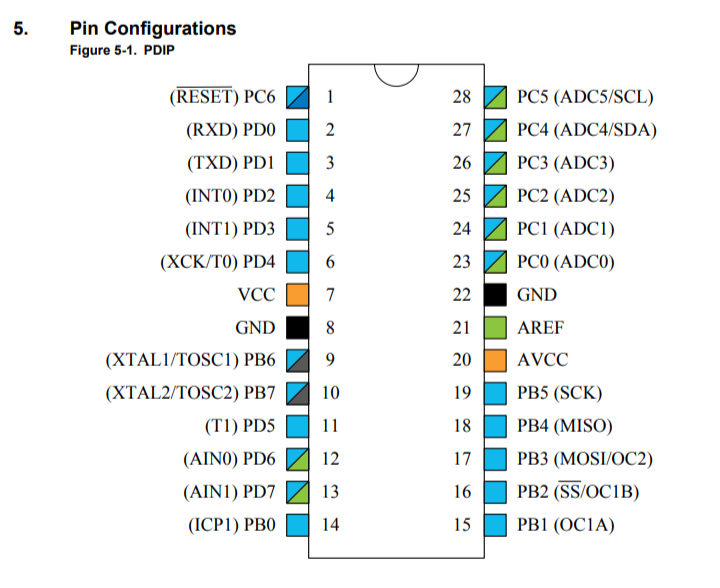
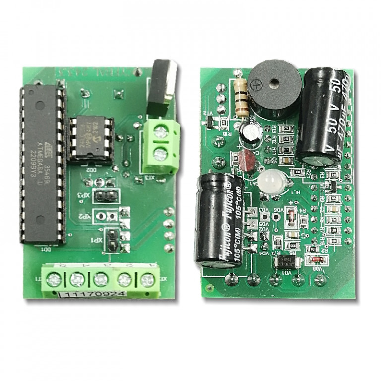
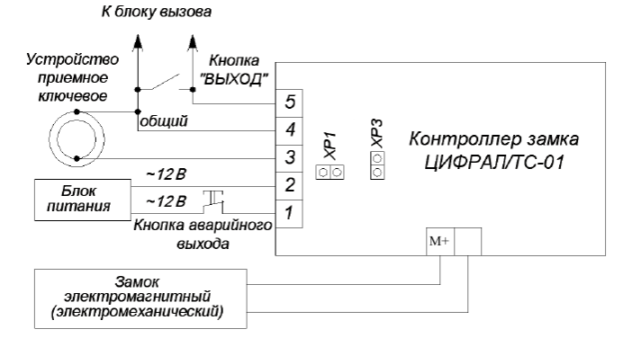
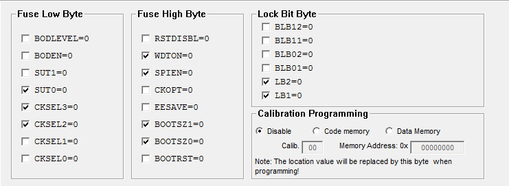

<!-- LANG_START -->
🇬🇧 [English version](README.en.md)
<!-- LANG_END -->

<div align="center">


</div>


<!-- STATS_START -->
<!-- auto-updated by GitHub Actions · 2026-06-28 14:58 UTC -->

[](https://github.com/gooog1111/cyfral-tc-01)
[](https://github.com/gooog1111/cyfral-tc-01)
[](https://github.com/gooog1111/cyfral-tc-01)
[](https://github.com/gooog1111/cyfral-tc-01)
[](https://github.com/gooog1111/cyfral-tc-01/stargazers)
[](https://github.com/gooog1111/cyfral-tc-01/network/members)
[](https://github.com/gooog1111/cyfral-tc-01/releases/latest)
[](https://github.com/gooog1111/cyfral-tc-01/releases)

<!-- STATS_END -->


<!-- GRAPH_START -->
<p align="center">
  
</p>
<!-- GRAPH_END -->


<!-- ISSUES_START -->
<!-- auto-updated by GitHub Actions · 2026-06-28 14:58 UTC -->

## Issues

<p>
  <a href="https://github.com/gooog1111/cyfral-tc-01/issues">
    
  </a>
  <a href="https://github.com/gooog1111/cyfral-tc-01/issues/new/choose">
    
  </a>
</p>

<details open>
<summary><b>Открытые issues</b></summary>


<p align="center">
  <b>Открытых issues нет.</b><br>
  <sub>Служебный issue <code>views-counter</code> скрыт из списка.</sub>
</p>


</details>

<p>
  <a href="https://github.com/gooog1111/cyfral-tc-01/issues/new/choose">Создать issue</a> ·
  <a href="https://github.com/gooog1111/cyfral-tc-01/issues">Все issues</a>
</p>

<!-- ISSUES_END -->


## Цифрал TC-01

Ошибки, предложения по добавлению функционала и другие задачи описывайте в [Issues](https://github.com/gooog1111/cyfral-tc-01/issues).

Проект не является оригинальной разработкой. Исходный код взят из публикации [Cyfral TC-01](https://allaboutdomofon.blogspot.com/2021/05/cyfral-tc-01.html), этот репозиторий содержит доработанную и документированную версию.

Прошивка для контроллера доступа Цифрал TC-01 на `ATmega8A`. Устройство работает с ключами iButton/1-Wire и совместимыми ключами, хранит базу во внешней EEPROM `24C64`, управляет электромагнитным или электромеханическим замком, имеет сервисное меню, кнопку открытия, светодиодную индикацию и зуммер.

## Текущая версия

Основные изменения этой версии:

- добавлена поддержка Dallas/Maxim `DS1992L+F5` и `DS1995L+F5`;
- сохранена поддержка `DS1990A/RW1990` и совместимых ключей;
- режим замка настраивается через 4-й пункт сервисного меню;
- автосбор ключей настраивается через 5-й пункт сервисного меню и по умолчанию выключен;
- для этой платы выход `LOCK` работает активным низким уровнем: удержание магнита соответствует `PC1 = 0`;
- короткие звуковые сигналы сбрасывают watchdog, поэтому 4-й пункт меню больше не вызывает перезагрузку;
- прошивка собирается под `F_CPU=4000000UL`, fuse `LOW=0xE3`.

## Поддерживаемые ключи

Прошивка пытается прочитать ключ несколькими способами:

| Тип | Поддержка | Примечание |
| --- | --- | --- |
| `DS1990A`, `RW1990`, аналоги | да | Dallas/1-Wire family `0x01` |
| `DS1992L+F5` | да | Dallas/1-Wire family `0x08` |
| `DS1995L+F5` | да | Dallas/1-Wire family `0x0A` |
| Metakom/MK-совместимые | да | читаются отдельным декодером `mk_rx()` |
| Cyfral-совместимые | да | читаются отдельным декодером `cyfral_rx()` |

Важное ограничение: база ключей пока использует старый 4-байтный внутренний формат. Для Dallas/1-Wire ключей читается полный 64-битный ROM, проверяется CRC, затем идентификатор сворачивается в 4 байта для совместимости с уже существующей базой EEPROM. Это сохраняет совместимость с текущими записанными ключами, но не использует весь 48-битный серийный номер DS1992/DS1995.

## Контроллер

Целевой микроконтроллер: `ATmega8A-PU`, корпус `PDIP-28`.

Параметры:

- Flash: `8 KB`;
- SRAM: `1 KB`;
- внутренняя EEPROM: `512 B`;
- питание логики: `5 V`;
- тактирование: внутренний RC около `4 MHz`;
- сборка: `avr-gcc`, цель `atmega8`, `F_CPU=4000000UL`.

Fuse-биты, использованные при прошивке:

```text
lfuse = 0xE3
hfuse = 0x99
lock  = 0xFF
```

`lock=0xFF` означает, что Flash не заблокирована. Финальную блокировку можно ставить отдельно только после полной проверки устройства.

## Распиновка ATmega8A-PU

Корпус `PDIP-28`, вид сверху, ключ/выемка сверху.



| Нога | Порт | Назначение |
| ---: | --- | --- |
| 1 | `PC6/RESET` | Reset, ISP |
| 2 | `PD0/RXD` | не используется |
| 3 | `PD1/TXD` | софт-UART отладка |
| 4 | `PD2/INT0` | не используется |
| 5 | `PD3/INT1` | не используется |
| 6 | `PD4/T0` | не используется |
| 7 | `VCC` | питание `+5V` |
| 8 | `GND` | земля |
| 9 | `PB6/XTAL1` | не используется, внутренний RC |
| 10 | `PB7/XTAL2` | не используется, внутренний RC |
| 11 | `PD5/T1` | `E_TD` |
| 12 | `PD6/AIN0` | `TC` |
| 13 | `PD7/AIN1` | `E_TC` |
| 14 | `PB0/ICP1` | не используется |
| 15 | `PB1/OC1A` | `TD`, линия ключа Dallas/1-Wire |
| 16 | `PB2/SS/OC1B` | не используется |
| 17 | `PB3/MOSI/OC2` | `RED`, красный LED, ISP MOSI |
| 18 | `PB4/MISO` | `XP3`, сервисная перемычка, ISP MISO |
| 19 | `PB5/SCK` | `GREEN`, зелёный LED, ISP SCK |
| 20 | `AVCC` | питание аналоговой части, подключить к `+5V` |
| 21 | `AREF` | не используется |
| 22 | `GND` | земля |
| 23 | `PC0/ADC0` | `WP`, защита записи EEPROM 24C64 |
| 24 | `PC1/ADC1` | `LOCK`, управление замком |
| 25 | `PC2/ADC2` | `BEEP`, зуммер |
| 26 | `PC3/ADC3` | `SW`, кнопка открытия двери |
| 27 | `PC4/ADC4/SDA` | `SDA`, EEPROM 24C64 |
| 28 | `PC5/ADC5/SCL` | `SCL`, EEPROM 24C64 |

Линии ISP `MOSI/MISO/SCK` одновременно используются платой для LED и перемычки `XP3`. Если ArduinoISP не прошивает контроллер, временно отключить внешние нагрузки с `PB3/PB4/PB5` или проверить, что они не мешают уровням SPI.

## Подключение

Фото платы:





Основные узлы:

- `TD` (`PB1`) - линия чтения ключей Dallas/1-Wire;
- `SDA/SCL` (`PC4/PC5`) - программный I2C для `24C64`;
- `WP` (`PC0`) - управление защитой записи `24C64`;
- `LOCK` (`PC1`) - выход управления силовым ключом замка;
- `BEEP` (`PC2`) - зуммер;
- `SW` (`PC3`) - кнопка открытия замка;
- `XP3` (`PB4`) - сервисная перемычка;
- `RED/GREEN` (`PB3/PB5`) - индикация.

Клеммы платы:

| Контакты | Назначение |
| --- | --- |
| `1`, `2` | питание устройства `12 V AC` |
| `3`, `4` | считыватель ключей, контакт `4` - общий минус |
| `4`, `5` | кнопка открытия замка `SW`, контакт `4` - общий минус |
| `M+` и минус | выход на замок; на `M+` к замку должно быть около `19 V DC` |

Контакт `4` используется как общий минус для считывателя и кнопки открытия.

## Управление замком

Выход `LOCK` управляет силовым транзистором активным низким уровнем.

### Режим 1: электромагнитный замок

Используется для магнита, которому нужно постоянное питание в закрытом состоянии.

- Ожидание: `PC1/LOCK = 0`, транзистор открыт, магнит удерживает.
- Открытие: `PC1/LOCK = 1`, транзистор закрыт, питание с магнита снимается.
- После таймера открытия: снова `PC1/LOCK = 0`.

### Режим 2: электромеханический замок

Используется для замка, которому питание подаётся только на время открытия.

- Ожидание: `PC1/LOCK = 1`, транзистор закрыт, питания на замке нет.
- Открытие: `PC1/LOCK = 0`, транзистор открыт, питание подаётся.
- После таймера открытия: снова `PC1/LOCK = 1`.

Режим хранится во внутренней EEPROM ATmega8A по адресу `0x09`:

- `0xFF` - режим 1, электромагнитный;
- `0x00` - режим 2, электромеханический.

Если значение повреждено, прошивка восстанавливает режим 1.

Режим автосбора хранится по адресу `0x0A`:

- `0xFF` - автосбор выключен;
- `0x00` - автосбор включён.

При повреждённом значении и после полного сброса автосбор выключается.

## Время открытия

Время открытия хранится во внешней EEPROM `24C64` в служебном блоке. Единица измерения - `100 ms`.

- значение по умолчанию: `0x0032`, то есть `50 * 100 ms = 5 секунд`;
- максимум: `0x0C00`, то есть около `307.2 секунд`;
- если значение повреждено или слишком большое, используется значение по умолчанию.

Во время открытия зуммер включён постоянно, зелёный LED горит, выход `LOCK` переведён в состояние открытия.

## Память EEPROM 24C64

Внешняя EEPROM `24C64` используется для базы ключей и параметров.

| Адрес | Размер | Назначение |
| --- | ---: | --- |
| `0x0000..0x0003` | 4 байта | служебный блок |
| `0x0000..0x0001` | 2 байта | количество пользовательских ключей |
| `0x0002..0x0003` | 2 байта | время открытия в тиках по 100 ms |
| `0x0004..0x0007` | 4 байта | мастер-ключ |
| `0x0008..0x1FFF` | по 4 байта | пользовательские ключи |

Пустая ячейка ключа: `0xFFFFFFFF`. Такой ключ запрещён к записи.

При старте выполняется самодиагностика:

- проверяется доступность EEPROM;
- проверяется мастер-ключ;
- проверяется CRC ключей;
- проверяется отсутствие непустых ключей после первой пустой ячейки;
- проверяется счётчик ключей в заголовке.

После трёх подряд ошибок EEPROM включается аварийное поведение: корректно прочитанный ключ может открыть дверь по общему таймеру.

## Обычный режим

При запуске без перемычки `XP3` устройство входит в обычный режим.

Поведение:

- в ожидании периодически мигает красный LED;
- кнопка `SW` открывает дверь сразу;
- мастер-ключ в обычном режиме работает как обычный разрешённый ключ;
- пользовательский ключ из базы открывает дверь;
- неизвестный ключ не открывает дверь и получает сигнал отказа;
- при включённом автосборе любой корректный ключ открывает дверь, а неизвестный сохраняется в базе;
- если EEPROM повреждена, после нескольких ошибок включается аварийная логика.

## Сервисный режим

Сервисный режим включается перемычкой `XP3`.

Вход:

- если `XP3` установлена при включении питания, устройство сразу входит в сервисный режим;
- если `XP3` установить во время работы, устройство переходит в сервисный режим из обычного режима;
- при входе звучат `3` длинных сигнала.

В сервисном режиме управление выполняется кнопкой `SW` и мастер-ключом.

## Сервисное меню

Вход в меню:

- установить перемычку `XP3`;
- приложить мастер-ключ;
- после подтверждения нажать кнопку `SW`.

Навигация:

- короткое нажатие `SW` - следующий пункт меню;
- длинное нажатие `SW` - выбрать текущий пункт;
- пункты идут по кругу;
- номер пункта озвучивается короткими сигналами.

Пункты меню:

| Пункт | Сигнал | Назначение |
| ---: | --- | --- |
| 1 | `1` короткий | добавление пользовательских ключей |
| 2 | `2` коротких | настройка времени открытия |
| 3 | `3` коротких | удаление пользовательских ключей |
| 4 | `4` коротких | настройка режима замка |
| 5 | `5` коротких | настройка автосбора ключей |

### Пункт 1: добавление ключей

После входа в пункт:

- приложить новый ключ;
- если ключ добавлен, звучит `1` длинный сигнал;
- если ключ уже есть, звучат `2` коротких;
- мастер-ключ не добавляется как пользовательский;
- короткое нажатие `SW` выходит из пункта обратно в меню.

### Пункт 2: время открытия

После входа в пункт:

- нажать `SW`, чтобы начать отсчёт;
- каждую секунду звучит `1` короткий сигнал;
- нажать `SW` ещё раз, чтобы сохранить время;
- сохранение подтверждается `2` короткими сигналами.

Внутри прошивки сохранённое значение переводится в тики по 100 ms.

### Пункт 3: удаление ключей

После входа в пункт:

- приложить пользовательский ключ;
- если ключ удалён, звучит `1` короткий сигнал;
- если ключа нет в базе, звучат `2` коротких;
- мастер-ключ не удаляется;
- короткое нажатие `SW` выходит из пункта обратно в меню.

### Пункт 4: режим замка

После выбора пункта длинным нажатием:

- устройство входит в настройку режима замка;
- сразу озвучивает текущий режим: `1` короткий или `2` коротких;
- короткое нажатие переключает `1 -> 2 -> 1` по кругу;
- длинное нажатие сохраняет выбранный режим;
- после сохранения звучит `1` длинный сигнал выхода и затем `1` или `2` коротких, какой режим сохранён.

Для электромагнитного замка на текущей плате нужен режим `1`.

### Пункт 5: автосбор ключей

- устройство сразу озвучивает текущий режим: `1` короткий - выключен, `2` коротких - включён;
- короткое нажатие переключает режимы `1 -> 2 -> 1`;
- длинное нажатие сохраняет выбранный режим;
- при включённом автосборе любой корректно прочитанный ключ открывает дверь;
- неизвестный ключ перед открытием добавляется в базу, уже записанный ключ повторно не сохраняется;
- если ключ не удалось записать из-за ошибки или заполненной памяти, дверь всё равно открывается.

## Сброс и новый мастер-ключ

В сервисном режиме можно полностью очистить базу и записать новый мастер-ключ:

1. Установить перемычку `XP3`.
2. Удерживать кнопку `SW` около `10 секунд`.
3. После сигнала приложить новый мастер-ключ.
4. Прошивка очистит пользовательские ключи, восстановит параметры по умолчанию и запишет мастер-ключ.

После сброса:

- мастер-ключ записан заново;
- список пользовательских ключей пуст;
- время открытия возвращается к `5 секундам`;
- режим замка возвращается к режиму `1`.
- автосбор ключей выключается.

## Сигналы

| Событие | Сигнал |
| --- | --- |
| Вход в сервисный режим | `3` длинных |
| Пункт меню | `1..5` коротких |
| Выбор пункта меню | `1` длинный |
| Ключ добавлен | `1` длинный |
| Ключ уже есть | `2` коротких |
| Ключ удалён | `1` короткий |
| Ключ не найден при удалении | `2` коротких |
| Отказ неизвестному ключу | `2` коротких + `2` длинных |
| Ошибка операции | частая трель |
| Сохранение времени открытия | `2` коротких |
| Сохранение режима замка | `1` длинный + номер режима |

## Сборка

Прошивка собирается обычным AVR toolchain под `ATmega8`:

- `avr-gcc`;
- `avr-libc`;
- `avr-objcopy`;
- `avr-size`;
- `make`;
- `avrdude` для прошивки.

### Windows

Самый простой вариант - пакет ZakKemble AVR-GCC:

```powershell
winget install ZakKemble.avr-gcc
```

После установки открыть новый PowerShell и проверить инструменты:

```powershell
avr-gcc --version
make --version
avrdude -?
```

Если `make` или `avrdude` не находятся, добавить каталог `bin` установленного AVR-GCC в `PATH` или запускать инструменты по полному пути. Для пакета из `winget` путь обычно похож на:

```powershell
$env:LOCALAPPDATA\Microsoft\WinGet\Packages\ZakKemble.avr-gcc_Microsoft.Winget.Source_8wekyb3d8bbwe\avr-gcc-14.1.0-x64-windows\bin
```

Сборка:

```powershell
make
```

Очистка и повторная сборка:

```powershell
make clean
make
```

### Linux

Debian/Ubuntu:

```bash
sudo apt update
sudo apt install gcc-avr avr-libc binutils-avr make avrdude srecord
```

Arch Linux:

```bash
sudo pacman -S avr-gcc avr-libc avr-binutils make avrdude srecord
```

Fedora:

```bash
sudo dnf install avr-gcc avr-libc avr-binutils make avrdude srecord
```

Сборка:

```bash
make clean
make
```

Результат сборки:

- `TC-01.elf` - ELF-файл для отладки и просмотра размера;
- `TC-01.hex` - Intel HEX для записи во Flash ATmega8A.

Ожидаемый размер текущей версии:

```text
text = 5480
data = 0
bss  = 2
dec  = 5482
```

## Разбивка HEX на чанки

Обычно прошивку можно писать одним файлом `TC-01.hex`. Чанки нужны только если программатор или схема зависает на длинной записи/проверке, чаще всего это встречается с ArduinoISP.

Для разбиения удобно использовать `srec_cat` из пакета `srecord`. ATmega8 имеет `8 KB` Flash, поэтому можно разбить файл на блоки по `1 KB`.

Windows PowerShell:

```powershell
New-Item -ItemType Directory -Force chunks | Out-Null
srec_cat TC-01.hex -Intel -crop 0x0000 0x0400 -o chunks/TC-01_0000_03ff.hex -Intel
srec_cat TC-01.hex -Intel -crop 0x0400 0x0800 -o chunks/TC-01_0400_07ff.hex -Intel
srec_cat TC-01.hex -Intel -crop 0x0800 0x0c00 -o chunks/TC-01_0800_0bff.hex -Intel
srec_cat TC-01.hex -Intel -crop 0x0c00 0x1000 -o chunks/TC-01_0c00_0fff.hex -Intel
srec_cat TC-01.hex -Intel -crop 0x1000 0x1400 -o chunks/TC-01_1000_13ff.hex -Intel
srec_cat TC-01.hex -Intel -crop 0x1400 0x1800 -o chunks/TC-01_1400_17ff.hex -Intel
srec_cat TC-01.hex -Intel -crop 0x1800 0x1c00 -o chunks/TC-01_1800_1bff.hex -Intel
srec_cat TC-01.hex -Intel -crop 0x1c00 0x2000 -o chunks/TC-01_1c00_1fff.hex -Intel
```

Linux:

```bash
mkdir -p chunks
srec_cat TC-01.hex -Intel -crop 0x0000 0x0400 -o chunks/TC-01_0000_03ff.hex -Intel
srec_cat TC-01.hex -Intel -crop 0x0400 0x0800 -o chunks/TC-01_0400_07ff.hex -Intel
srec_cat TC-01.hex -Intel -crop 0x0800 0x0c00 -o chunks/TC-01_0800_0bff.hex -Intel
srec_cat TC-01.hex -Intel -crop 0x0c00 0x1000 -o chunks/TC-01_0c00_0fff.hex -Intel
srec_cat TC-01.hex -Intel -crop 0x1000 0x1400 -o chunks/TC-01_1000_13ff.hex -Intel
srec_cat TC-01.hex -Intel -crop 0x1400 0x1800 -o chunks/TC-01_1400_17ff.hex -Intel
srec_cat TC-01.hex -Intel -crop 0x1800 0x1c00 -o chunks/TC-01_1800_1bff.hex -Intel
srec_cat TC-01.hex -Intel -crop 0x1c00 0x2000 -o chunks/TC-01_1c00_1fff.hex -Intel
```

Пустые верхние чанки допустимы, если прошивка занимает меньше 8 KB. Для записи блоками первый блок пишется с очисткой чипа, остальные - с `-D`, чтобы не стирать уже записанные страницы.

## Прошивка через ArduinoISP

Подготовка Arduino Uno:

1. Подключить Arduino Uno к USB.
2. Открыть Arduino IDE.
3. Выбрать плату `Arduino Uno`.
4. Открыть пример `File -> Examples -> 11.ArduinoISP -> ArduinoISP`.
5. Загрузить скетч в Arduino Uno.
6. Поставить конденсатор `10 uF` между `RESET` и `GND` Arduino Uno, чтобы Uno не перезагружалась при запуске `avrdude`.

Подключение ISP:

| Arduino Uno | ATmega8A |
| --- | --- |
| `D10` | `RESET`, pin 1 |
| `D11` | `MOSI/PB3`, pin 17 |
| `D12` | `MISO/PB4`, pin 18 |
| `D13` | `SCK/PB5`, pin 19 |
| `5V` | `VCC`, pin 7 |
| `5V` | `AVCC`, pin 20 |
| `GND` | `GND`, pins 8 и 22 |

Проверка связи, fuse и lock:

```powershell
avrdude -c stk500v1 -P COM3 -b 19200 -p m8 -U lfuse:r:-:h -U hfuse:r:-:h -U lock:r:-:h
```

Ожидаемо:

```text
lfuse = 0xe3
hfuse = 0x99
lock  = 0xff
```

Обычная запись:

```powershell
avrdude -c stk500v1 -P COM3 -b 19200 -p m8 -U flash:w:TC-01.hex:i -U lfuse:w:0xE3:m -U hfuse:w:0x99:m
```

Для Linux порт обычно выглядит как `/dev/ttyACM0` или `/dev/ttyUSB0`:

```bash
avrdude -c stk500v1 -P /dev/ttyACM0 -b 19200 -p m8 -U flash:w:TC-01.hex:i -U lfuse:w:0xE3:m -U hfuse:w:0x99:m
```

На этой схеме ArduinoISP может зависать при длинном чтении Flash во время verify. Если verify зависает, использовать запись короткими блоками из каталога `chunks/` с отключенной проверкой чтением:

- первый блок пишется с chip erase;
- остальные блоки пишутся с `-D`;
- все блоки пишутся с `-V`.

Windows PowerShell:

```powershell
avrdude -c stk500v1 -P COM3 -b 19200 -p m8 -V -U flash:w:chunks/TC-01_0000_03ff.hex:i
avrdude -c stk500v1 -P COM3 -b 19200 -p m8 -D -V -U flash:w:chunks/TC-01_0400_07ff.hex:i
avrdude -c stk500v1 -P COM3 -b 19200 -p m8 -D -V -U flash:w:chunks/TC-01_0800_0bff.hex:i
avrdude -c stk500v1 -P COM3 -b 19200 -p m8 -D -V -U flash:w:chunks/TC-01_0c00_0fff.hex:i
avrdude -c stk500v1 -P COM3 -b 19200 -p m8 -D -V -U flash:w:chunks/TC-01_1000_13ff.hex:i
avrdude -c stk500v1 -P COM3 -b 19200 -p m8 -D -V -U flash:w:chunks/TC-01_1400_17ff.hex:i
avrdude -c stk500v1 -P COM3 -b 19200 -p m8 -D -V -U flash:w:chunks/TC-01_1800_1bff.hex:i
avrdude -c stk500v1 -P COM3 -b 19200 -p m8 -D -V -U flash:w:chunks/TC-01_1c00_1fff.hex:i
avrdude -c stk500v1 -P COM3 -b 19200 -p m8 -U lfuse:w:0xE3:m -U hfuse:w:0x99:m
```

Linux:

```bash
avrdude -c stk500v1 -P /dev/ttyACM0 -b 19200 -p m8 -V -U flash:w:chunks/TC-01_0000_03ff.hex:i
avrdude -c stk500v1 -P /dev/ttyACM0 -b 19200 -p m8 -D -V -U flash:w:chunks/TC-01_0400_07ff.hex:i
avrdude -c stk500v1 -P /dev/ttyACM0 -b 19200 -p m8 -D -V -U flash:w:chunks/TC-01_0800_0bff.hex:i
avrdude -c stk500v1 -P /dev/ttyACM0 -b 19200 -p m8 -D -V -U flash:w:chunks/TC-01_0c00_0fff.hex:i
avrdude -c stk500v1 -P /dev/ttyACM0 -b 19200 -p m8 -D -V -U flash:w:chunks/TC-01_1000_13ff.hex:i
avrdude -c stk500v1 -P /dev/ttyACM0 -b 19200 -p m8 -D -V -U flash:w:chunks/TC-01_1400_17ff.hex:i
avrdude -c stk500v1 -P /dev/ttyACM0 -b 19200 -p m8 -D -V -U flash:w:chunks/TC-01_1800_1bff.hex:i
avrdude -c stk500v1 -P /dev/ttyACM0 -b 19200 -p m8 -D -V -U flash:w:chunks/TC-01_1c00_1fff.hex:i
avrdude -c stk500v1 -P /dev/ttyACM0 -b 19200 -p m8 -U lfuse:w:0xE3:m -U hfuse:w:0x99:m
```

После записи блоками проверять только сигнатуру, fuse и lock, не делать длинный dump/verify Flash.

Если `avrdude` установлен через пакет ZakKemble AVR-GCC и не находит `avrdude.conf`, запускать с явным `-C`, например:

```powershell
avrdude -C "$env:LOCALAPPDATA\Microsoft\WinGet\Packages\ZakKemble.avr-gcc_Microsoft.Winget.Source_8wekyb3d8bbwe\avr-gcc-14.1.0-x64-windows\bin\avrdude.conf" -c stk500v1 -P COM3 -b 19200 -p m8 -U lfuse:r:-:h -U hfuse:r:-:h -U lock:r:-:h
```

## Прошивка через USBasp / AVRASP / USBASP 2.0

USBasp, AVRASP и многие платы с надписью `USBASP 2.0` в `avrdude` обычно используются как программатор `usbasp`.

Подключение ISP:

| USBasp | ATmega8A |
| --- | --- |
| `MOSI` | `MOSI/PB3`, pin 17 |
| `MISO` | `MISO/PB4`, pin 18 |
| `SCK` | `SCK/PB5`, pin 19 |
| `RST` / `RESET` | `RESET`, pin 1 |
| `VCC` | `VCC`, pin 7 и `AVCC`, pin 20 |
| `GND` | `GND`, pins 8 и 22 |

Если плата питается отдельно, не подключать `VCC` от программатора, оставить только общую землю `GND`.

Проверка связи:

```powershell
avrdude -c usbasp -p m8 -U lfuse:r:-:h -U hfuse:r:-:h -U lock:r:-:h
```

Запись прошивки и fuse:

```powershell
avrdude -c usbasp -p m8 -U flash:w:TC-01.hex:i -U lfuse:w:0xE3:m -U hfuse:w:0x99:m
```

На Linux команды такие же. Если обычный пользователь не имеет доступа к USBasp, запускать через `sudo` или добавить udev-правило:

```bash
sudo avrdude -c usbasp -p m8 -U flash:w:TC-01.hex:i -U lfuse:w:0xE3:m -U hfuse:w:0x99:m
```

Если USBasp старый и `avrdude` пишет предупреждение про `cannot set sck period`, это не всегда ошибка. Если связь нестабильна, поставить перемычку `slow SCK` на USBasp или добавить ключ `-B 10`:

```bash
avrdude -c usbasp -B 10 -p m8 -U flash:w:TC-01.hex:i -U lfuse:w:0xE3:m -U hfuse:w:0x99:m
```

## Прошивка через AVRISP / AVRISP mkII

Для оригинального Atmel/Microchip AVRISP mkII и совместимых программаторов в `avrdude` используется `-c avrispmkII`.

Проверка:

```bash
avrdude -c avrispmkII -P usb -p m8 -U lfuse:r:-:h -U hfuse:r:-:h -U lock:r:-:h
```

Запись:

```bash
avrdude -c avrispmkII -P usb -p m8 -U flash:w:TC-01.hex:i -U lfuse:w:0xE3:m -U hfuse:w:0x99:m
```

Если используется старый последовательный AVRISP/STK500-совместимый программатор, команда обычно выглядит так:

```bash
avrdude -c avrisp -P COM3 -b 19200 -p m8 -U flash:w:TC-01.hex:i -U lfuse:w:0xE3:m -U hfuse:w:0x99:m
```

На Linux вместо `COM3` использовать свой порт, например `/dev/ttyUSB0`.

## ST-Link V2

ST-Link V2 напрямую не прошивает `ATmega8A` по AVR ISP. Он рассчитан на STM8/STM32 через SWIM/SWD, а у ATmega8A используется SPI ISP.

Использовать ST-Link V2 для этой платы можно только если он перепрошит альтернативной прошивкой, которая превращает его в AVR ISP-совместимый программатор. В обычном состоянии для TC-01 нужны ArduinoISP, USBasp/AVRASP, AVRISP mkII или другой программатор, поддерживаемый `avrdude` для `-p m8`.

## Fuse-биты

Текущая прошивка рассчитана на внутренний RC-генератор около `4 MHz`:

```text
lfuse = 0xE3
hfuse = 0x99
lock  = 0xFF
```

Перед записью fuse желательно сначала прочитать текущие значения. Неверные fuse могут отключить ISP или выбрать неподключенный источник тактирования.



## Диагностика замка

Если электромагнитный замок не держит

1. Убедиться, что в пункте 4 сохранён режим `1`.
2. Измерить напряжение прямо на клеммах магнита при подключённом магните.
3. Измерить `PC1/LOCK`, pin 24 ATmega8A:
   - в режиме ожидания режима `1` должно быть около `0 V`;
   - при открытии должно быть около `5 V`.
4. Если `PC1` переключается правильно, а магнит слабый, искать проблему в питании, силовом транзисторе, проводке, земле, самом магните или ответной части.

Прошивка не использует ШИМ для замка. Выход `LOCK` держится постоянно в одном состоянии и переключается только на время открытия.
